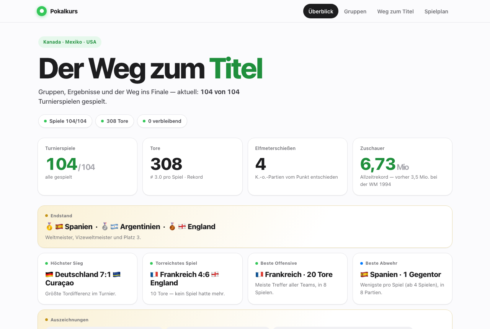

# World Cup 2026 prediction engine

Most football prediction code answers "who wins?". This answers a different
question: **given a points table, which scoreline should I actually write down?**

Those are not the same answer. If a knockout tie is 45% draw, the most likely
single scoreline might be 1:1 — but under a table that pays 6 for an exact hit
and 3 for the right tendency, a different guess is worth more. This repository
takes a score-probability matrix and maximises expected points against a
configurable scoring table. Everything else — Poisson rates, Dixon-Coles
correlation, market blending, climate and travel effects — exists to make that
matrix good enough to be worth optimising.

The other reason it is not another Poisson demo: it is **validated against
seven completed tournaments**, and the honest result is a thin edge, reported
below including the two tournaments where it loses.

**Zero dependencies.** Standard library only — core and `analysis/` alike.
No install step, no virtualenv, no lockfile. `python3` is the whole toolchain.

---

## The tournament page

`analysis/wm_journey.py` generates a self-contained tournament dashboard —
group tables, a knockout bracket you play yourself, the full schedule. One HTML
file, data embedded, no external requests, deploys anywhere static.



**Live demo: <https://pokalkurs.netlify.app>** — the author's instance, rebuilt from this code.

It deliberately contains **no predictions at all**. No win probabilities, no
model tips, no title odds. It is the tournament, not the model — which is why
it can be shared with people who do not care about any of this.

Two things to know before you click: the page's interface is **in German**, and
so are the code comments throughout this repository. Documentation is English,
the software is not. Branding (name, headline, accent colour) is configurable —
see `analysis/README.md`.

---

## Quickstart

```bash
git clone <this-repo>
cd <this-repo>

# 1. Fetch the fixture list (openfootball, no key needed)
PYTHONPATH=src python3 -m wm_tipps.cli refresh-fixtures

# 2. Backtest the model against seven completed tournaments
PYTHONPATH=src python3 -m wm_tipps.cli backtest-report

# 3. Build the tournament page (then open analysis/site/index.html in a browser)
python3 analysis/wm_journey.py

# 4. Run the test suite
python3 -m unittest discover -s tests
```

Step 2 works on a fresh clone: the seven backtest datasets
(`data/backtest_2010.json` … `data/backtest_euro-2024.json`) are tracked, so
there is nothing to download and no example data to invent.

For live tips you also need odds and a squad list — see **Running it live**.

---

## What the model does

Per fixture, in order:

1. **Base expected goals** from World Football Elo and the FIFA ranking, plus a
   squad-depth proxy built from CC0 international goalscorer data.
2. **Context modifiers** (`src/wm_tipps/context.py`). The 2026 tournament spans
   three countries and roughly 2,200 m of altitude. The module models heat
   stress (a WBGT approximation), altitude, and travel/time-zone load since a
   team's previous match — asymmetrically, because a sea-level side loses more
   in Mexico City than the reverse.
3. **News and lineup signals** — confirmed absences of key players reduce xG;
   travel disruption does the same.
4. **Score matrix** — Poisson, with a Dixon-Coles correlation term
   (`DRAW_DC_RHO`) that corrects low-scoring cells.
5. **Market blend** — no-vig 1X2 consensus mixed in at a deliberately modest
   weight.
6. **Tip selection** — the scoreline maximising expected points under the
   configured scoring table (`src/wm_tipps/scoring.py`).

## What the backtest says

Seven completed tournaments — World Cups 2010, 2014, 2018, 2022 and Euros 2016,
2020, 2024 — 405 matches, scored with a 2/3/4 group and 3/4/6 knockout table.
Regenerate with `backtest-report`.

| Variant | Points/match (405) | On the 342 odds-covered matches |
|---|---|---|
| Elo only | 1.854 | 1.854 |
| Odds only | — | 1.880 |
| **Ensemble** | **1.909** | **1.915** |

The full apparatus buys **+0.055 points per match over Elo alone** and
**+0.035 over a plain odds-derived tip**. On a 64-match tournament that is
between two and four points.

The repository's own decision rule calls that **`needs_more_data`**: it requires
at least +0.05 per match over odds-only before treating the extra machinery as
established, and +0.035 is inside the noise band. That is the honest headline.
Not "we beat the market" — the model is, at best, marginally ahead of a tip
derived from the closing 1X2 line, and the evidence is not yet strong enough to
call it.

Per tournament, ensemble vs. odds-only:

| Tournament | n | Ensemble | Odds only |
|---|---|---|---|
| WC 2010 | 63 | 1.873 | no odds data |
| WC 2014 | 63 | 2.159 | 2.063 |
| WC 2018 | 63 | 1.968 | 1.841 |
| WC 2022 | 63 | 1.762 | 1.619 |
| **Euro 2016** | 51 | **1.471** | **1.745** |
| Euro 2020 | 51 | 2.098 | 2.000 |
| **Euro 2024** | 51 | **2.000** | **2.039** |

**Where it is bad:** Euro 2016 is a rout in the wrong direction — the model
trails odds-only by 0.274 points per match, by far its worst result, on a
tournament full of low-scoring upsets that a goal-expectation model reads
badly. Euro 2024 is a smaller loss. Four tournaments ahead, two behind: a
majority, not a consensus. Euro 2016 alone is reason enough not to trust the
edge on any single tournament.

Two caveats on the numbers themselves:

- The `naive` variant in the report output is **not** an independent baseline.
  It falls back to the Elo tip when no separate favourite tip exists
  (`backtest.py`), which is why both rows are identical. Do not read it as
  "model vs. naive".
- The odds baseline is a scoreline **derived** from 1X2 prices, not a real
  historical exact-score market. It is a sanity check, not proof of a betting
  edge. Nothing here should be read as one.

---

## Architecture

```
src/wm_tipps/     the engine (stdlib)
  scoring.py        points rules, round profiles, expected-points tip choice
  model.py          strength -> xG -> score matrix -> tip
  context.py        heat, altitude, travel
  knockout.py       Monte-Carlo bracket simulation
  backtest.py       validation across seven tournaments
  historical.py     openfootball loader with local cache
  news*.py          news ingestion and relevance filtering
  rival_profiles.py how the other players in your round tip
  risk_dial.py      what buying variance costs, and when it pays
  deficit_policy.py mirror the field, decorrelate, or tip normally
  cli.py            entry point for everything
tests/            unittest, no framework needed
analysis/         read-only exploratory scripts + the tournament page (stdlib)
data/             tracked source data; generated artefacts are gitignored
exports/          a few sample outputs, so you can see the shape before running
```

The handful of files in `exports/` are **dated sample runs from the 2026
tournament**, kept so you can see what the commands produce without running
anything. Each carries its own run date in the header. Two of them —
`entry_watch.md` and `matchday_dry_run.md` — only ever look at matches kicking
off in the next few days, so regenerating them now that the tournament is over
would just produce an empty document. They are examples, not live state.

Nothing outside the standard library, anywhere. The CLI is the only entry
point: `PYTHONPATH=src python3 -m wm_tipps.cli --help`.

## Configuring your own tip round

The two built-in profiles are generic Kicktipp schemes: `classic`
(2/3/4 group, 3/4/6 knockout) and `escalating` (knockout points rising to
4/6/8 in the late rounds). To use your own:

```bash
cp src/wm_tipps/rounds_local.example.py src/wm_tipps/rounds_local.py
```

Edit it and you are done — every module reads the registry through
`wm_tipps.scoring`. The file is gitignored, because a round id usually
identifies a real group. The example file documents every field, including the
one non-obvious rule: whether knockout ties are scored including the penalty
shootout tally depends on a marker in `result_scope`.

## Using this for another tournament

The **engine** is tournament-agnostic — the backtest exercises it against seven
different tournaments with the same code. The **live wiring** is specific to
the 2026 World Cup. Porting it means editing four places:

1. `src/wm_tipps/fixtures.py` — the openfootball source URL.
2. `src/wm_tipps/context.py` — `HOST_CITIES` (coordinates, altitude, climate).
3. `src/wm_tipps/knockout.py` — knockout kick-off times and venues.
4. `data/bracket_2026.json` — the bracket structure.

There is no abstraction layer over these four yet — that is the planned next
step, and it is genuinely testable rather than a leap of faith: `historical.py`
already pulls seven tournaments from the same openfootball path structure that
`fixtures.py` hard-codes for 2026. Pointing the live path at, say, the 2022
World Cup and checking that it reproduces what the backtest path produces for
the same tournament is a green-or-red proof. Until that exists, treat the list
above as a starting point rather than a recipe.

## Running it live

Beyond fixtures you need odds and a squad list:

```bash
PYTHONPATH=src python3 -m wm_tipps.cli refresh-odds       # reads data/manual_odds.csv
PYTHONPATH=src python3 -m wm_tipps.cli build-player-pool
PYTHONPATH=src python3 -m wm_tipps.cli build-predictions
PYTHONPATH=src python3 -m wm_tipps.cli serve-dashboard --port 8002
```

Odds can be maintained by hand in `data/manual_odds.csv`. There are also
importer modules that read bookmaker pages directly — see the caveat below.

---

## Limitations

Written down because they are real, not because they are polished away:

- **Extra time is a prior, not a model.** `scoring.py` uses a fixed factor for
  extra-time goals rather than fitting one from actual extra-time matches.
- **Bracket bootstrap is crude.** Before the group stage resolves,
  `model.py` seeds the knockout bracket with a top-N cut instead of real group
  table logic (head-to-head, goal difference, best-third-place ranking).
- **Live signals are not backtestable.** The lineup-absence and news-driven xG
  adjustments only exist going forward; there is no historical corpus to
  validate them against. They are forward-only by construction, and unproven.
- **A single tournament is a small sample.** 51–64 matches, and the per
  tournament spread above (1.471 to 2.159) is wider than the edge being
  claimed.
- **Scraper modules are fragile.** `bwin_exact_scores.py`,
  `bwin_match_odds.py` and `source_watch.py` talk to an undocumented internal
  bwin CDS endpoint (with a hard-coded public access id);
  `historical_markets.py` parses checkbestodds.com archive pages. These are
  reverse-engineered, not APIs with a contract. They can break without notice,
  and using them is your own decision and your own responsibility under those
  providers' terms of service. Everything else works without them — odds can be
  entered by hand.
- **`analysis/wm_distributions.py` refuses to run on a finished tournament.**
  It carries a hand-transcribed Wikipedia scorer table and gates it against
  `fixtures.json` with a checksum. Once the fixture data moves past the
  transcription, the two disagree and the script exits with `STALE: ...`
  rather than printing numbers built on mixed vintages. That is the intended
  behaviour, not a crash — but it does mean the script is unusable until you
  refresh the embedded table yourself. In this build the checksum does not
  match, so it will exit immediately.
- **One test is inert here.** `tests/test_scoring_drift_guard.py` cross-checks
  the scoring implementation against two exploratory copies that are not part
  of this repository (see below). It skips cleanly instead of failing, but it
  is not protecting anything in this build.
- **No dedicated tests** for `io.py`, `paths.py` or `cli.py`; they are covered
  only indirectly.
- **Internal task references in comments.** Code comments cite issue ids like
  `T-0104` that point at a private task file. They are provenance notes for
  decisions, not dead links you need — but they will not resolve to anything
  here. Stripping them across 40+ files was judged more risk than benefit.

## Opponent modelling — code included, data is yours to supply

A tip round is not a forecasting exercise. It pays *rank*, not points, and that
changes the optimal move: if you trail the leader with few matches left, the
per-match optimal tip is the wrong tip, because everyone else is playing it too.
Three commands deal with that:

| Command | Question it answers |
|---|---|
| `rival-profiles` | How does each opponent tip? Draw rate, goal appetite, similarity to the model, points actually scored. |
| `risk-dial` | Does buying variance pay? Points cost and spread per aggression level, plus the probability of closing a given deficit in a given number of matches. |
| `deficit-policy` | Given the table right now: mirror the field, deliberately decorrelate from it, or just tip normally? |

**The code ships. The data does not.** These modules read the tips and standings
of real people in the author's private round — that is other people's personal
data, and pseudonymisation does not make it publishable. So the three JSON files
they consume are absent, and `.gitignore` keeps them absent.

What you get instead are documented schemas with invented names and values:

```
data/manual_pool_tips.example.json    tips per round, player and match
data/manual_standings.example.json    observed table positions per matchday
data/manual_bonus_tips.example.json   bonus-question picks per player
```

Copy one to its real filename and fill it with your own round:

```bash
cp data/manual_pool_tips.example.json data/manual_pool_tips.json
PYTHONPATH=src python3 -m wm_tipps.cli rival-profiles
```

Run any of the three without those files and you get a short note naming the
missing file and its schema — not a traceback, and not silence. The dashboard
does the same: the three cards render an empty state that tells you which
command to run.

What the sample files **cannot** show you, stated plainly:

- They contain six matches and three players. Enough to see the shape of the
  output and to check that your own file parses — not enough for the statistics
  to mean anything. `rival-profiles` needs eight tips per player before it
  treats a profile as reliable.
- `risk-dial`'s comparison against the real field stays empty with them. That
  part needs model predictions for the same matches, and the sample match ids
  are from the 2026 tournament, which is over. The backtest half of the command
  works regardless.
- `manual_bonus_tips.example.json` documents the schema but has no consumer in
  this repository — bonus-question scoring lives in the pool-review code, which
  is not part of this extract. It ships so that the third file is not a blank
  in the set.

Getting the data out of Kicktipp is manual work — the tips of other players are
only visible on the site, and this project does not scrape it. In practice that
means reading them off the standings pages yourself. That is the honest cost,
and it is why these commands are optional rather than part of the pipeline.

Still genuinely absent: a Monte-Carlo simulation of finishing first in a
specific pool, and a post-tournament review dashboard. Both are welded to the
private data far more tightly than the three above, and would ship as empty
shells.

The engine does not depend on any of this. Delete the three modules and the CLI
and dashboard notice, offering fewer commands instead of failing.

## Data sources

| Source | Used for | Terms |
|---|---|---|
| [openfootball](https://github.com/openfootball) | fixtures, historical results | The project publishes its datasets as public domain — verify before redistributing. |
| [martj42/international_results](https://github.com/martj42/international_results) | international goalscorers | CC0, stated by the project |
| FIFA world ranking, World Football Elo | team strength anchors | Freely readable web pages. No licence is granted for redistribution; only derived numbers are stored here. |
| GDELT, public RSS feeds | news signals | Public endpoints, each under its own terms |
| bwin (internal CDS endpoint), checkbestodds.com | live and historical odds | **Undocumented, reverse-engineered.** No licence, no contract. See the scraper caveat above. |

Only the goalscorer dataset carries an explicit open licence. "Freely readable"
is not a licence, and this table does not claim otherwise. If you plan to
redistribute anything derived from these sources, check them yourself — this
listing is a description of what the code fetches, not legal advice.

## Maintenance

A personal project from one tournament, published because the engine seemed
worth sharing. Issues will be read. Pull requests only after discussing the
idea in an issue first, and there is no promise of support or of continued
development. There is intentionally no CONTRIBUTING.md — it would signal an
availability that is not being offered.

## Disclaimer

Not a betting tool. It produces tips for a points-based prediction game, is
validated only against that points table, and makes no claim of a betting edge
— the backtest above explicitly is not one. No warranty of any kind; see
LICENSE.

## License

MIT — see [LICENSE](LICENSE).
